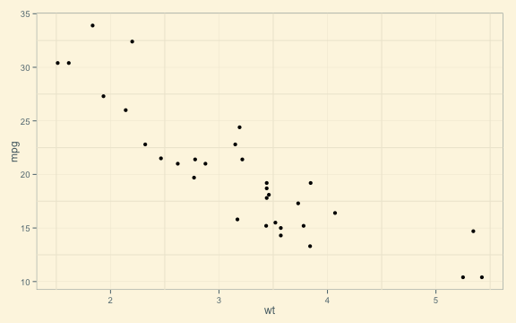

<script src="http://ajax.googleapis.com/ajax/libs/jquery/1.8.3/jquery.min.js"></script>


---

## Issues

1. Expose feature not working

---

## Test Features of Slidify ##

<style>
/* required to display toc when bootstrap is included. */
#toc, #help {
  visibility: visible
}
#toc {
 font-family: "Helvetica";
 font-size: 14px;
}

</style>

1. Mathjax
2. Layouts
3. Backgrounds
4. Widgets
5. Overlays
6. Metadata
7. Embeds

---
  
Setext Header
---
  
  
This slide shows a Setext style header.

---
  
## Tables
  
Mardown tables contain `---` and should not be interpreted as separator.

Column X | Column Y
---------|----------
Row 1    | Row 1
Row 2    | Row 2


---
  
## Animated List, Ordered
  
This list should be animated

> 1. Point 1
> 2. Point 2
> 3. Point 3

---
  
## Animated List, Unordered
  
This list should be animated

> - Point 1
> - Point 2
> - Point 3


--- bg:url({{page.url.assets}}/img/mathematics.jpg)

## Mathjax ##

$$
\begin{aligned}
\nabla \times \vec{\mathbf{B}} -\, \frac1c\, \frac{\partial\vec{\mathbf{E}}}{\partial t} & = \frac{4\pi}{c}\vec{\mathbf{j}} \\   \nabla \cdot \vec{\mathbf{E}} & = 4 \pi \rho \\
\nabla \times \vec{\mathbf{E}}\, +\, \frac1c\, \frac{\partial\vec{\mathbf{B}}}{\partial t} & = \vec{\mathbf{0}} \\
\nabla \cdot \vec{\mathbf{B}} & = 0 \end{aligned}
$$
<br />
$$
\mathbf{V}_1 \times \mathbf{V}_2 =  \begin{vmatrix}
\mathbf{i} & \mathbf{j} & \mathbf{k} \\
\frac{\partial X}{\partial u} &  \frac{\partial Y}{\partial u} & 0 \\
\frac{\partial X}{\partial v} &  \frac{\partial Y}{\partial v} & 0
\end{vmatrix}
$$
  
<div class='source'>
  Source: <a href='www.subtlepatterns.com'>Background from SubtlePatterns</a>
</div>

---

## Layouts, Custom Metadata ##

This is a slide with a two column layout.

*** =left

Column 1

*** =right

Column 2


--- bg:#EEE
  
## Background Color ##
  
This slide should have a subtle gray background.

--- bg:url(../assets/img/grid.png)

## Background Image ##

This slide should have a background image.

--- &radio .quiz

## Widgets: jQuery-Quiz ##

This is a multiple choice question

1. Choice 1
2. Choice 2
3. _Choice 3 (correct)_
4. Choice 4

*** .hint

This is a hint

*** .explanation

This is the explanation

---
  
## Widgets: Bootstrap ##
  
**Blocks**
  
<div class="alert alert-info">
 <p>This is an alert info block which should render in blue</p>
</div>
  
**Tooltips**
  
This is to check out tooltips in bootstrap <a href="#" rel="tooltip" data-original-title="Default tooltip">you probably</a>
  
**Popover**
  
<a class="btn btn-large btn-danger" rel="popover" data-content="And here's some amazing content. It's very engaging. right?" data-original-title="A Title" id='example'>Click to toggle popover</a>
  
*** =pnotes

The font size and color needs some tweaking.

---
  
## Highlighter: Highlight JS ##
  
We can make this function more robust by adding a simple error checking statement to prevent illegal parameters from generating invalid results.


```r
qpareto <- function(p, scale, loc) {
    if ((scale <= 0) | (loc <= 0)) {
        stop("'qpareto' parameters must be greater than zero.")
    }
    q <- loc * (1 - p)^(-1/scale)
    return(q)
}
```


Entering a negative parameter now raises an exception, instead of an invalid result that could silently corrupt subsequent results.


```r
qpareto(0.4, 5, -1)
```

```
## Error: 'qpareto' parameters must be greater than zero.
```

We could improve this further by checking to ensure that `p` is a valid probability.

---
  
## Check Chunk Execution ##
  

```r
library(ggplot2)
library(ggthemes)
qplot(wt, mpg, data = mtcars) + theme_solarized()
```

 


*** =pnotes


```r
library(ggplot2)
library(ggthemes)
qplot(wt, mpg, data = mtcars) + theme_solarized()
```


---
  
<q class='shout'>This is a shout</q>
  
I am checking key, <span class = 'key'>key</span>
